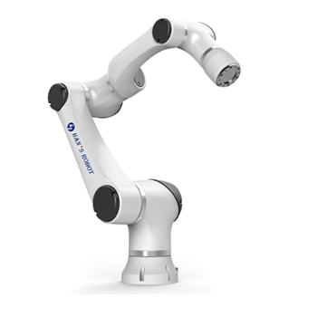

Elfin Robot
======


Chinese version of the README -> please [click here](./README_cn.md)


<p align="center">
  
</p>

This repository provides ROS 2 support for the Elfin Robot. The recommended
operating environment is **Ubuntu 24.04 with ROS 2 Jazzy**. The real-hardware
(EtherCAT) workflow has been migrated to and tested on Jazzy.

> The Gazebo simulation packages still target Gazebo Classic (`gazebo_ros2_control`),
> which is not available on Jazzy. Simulation has **not** yet been migrated to the
> new Gazebo (`ros_gz` / `gz_ros2_control`); use the real-hardware workflow on Jazzy.

### Installation

#### Ubuntu 24.04 + ROS 2 Jazzy

**Clone this repository into a workspace:**
```sh
$ mkdir -p ~/elfin_ws/src && cd ~/elfin_ws/src
$ git clone -b jazzy_ethercat https://github.com/rgruberski/elfin_robot_ros2.git
```

**Install dependencies.** The package manifests declare everything needed, so
`rosdep` resolves it for you:
```sh
$ cd ~/elfin_ws
$ source /opt/ros/jazzy/setup.bash
$ sudo rosdep init    # first time only
$ rosdep update
$ rosdep install --from-paths src --ignore-src -r -y
```

This pulls in, among others: `ros-jazzy-moveit`, `ros-jazzy-ros2-control`,
`ros-jazzy-joint-trajectory-controller`, `ros-jazzy-joint-state-broadcaster`,
`ros-jazzy-xacro`, `ros-jazzy-rviz2`, the GUI dependencies `python3-wxgtk4.0`
and `python3-transforms3d`, and the Boost libraries used by the EtherCAT driver.

**Build:**
```sh
$ cd ~/elfin_ws
$ colcon build --symlink-install
$ source install/setup.bash
```

> If `elfin_robot_msgs` fails on the first build with a transient
> `rosidl ... .o.d: No such file or directory`, just run `colcon build` again.

---

### Usage with real Hardware

***Below the commands are given for Elfin5. For Elfin3 / Elfin10 / Elfin15 /
Elfin5_l / Elfin10_l, replace the `elfin5` prefix accordingly.***

#### 1. Configure the robot

Put the `elfin_drivers.yaml` file you got from the vendor into
`elfin_robot_bringup/config/`, then copy its parameters into
`elfin_robot_bringup/config/elfin_arm_control.yaml` (this is the file the
launch files actually load). Important parameters in that file:

- **`elfin_ethernet_name`** — the network interface connected to the robot.
  Find it with `ip a` (e.g. `enp6s0`). The robot port is usually `UP` with no
  IP address.
  ```yaml
  elfin_ethernet_name: enp6s0
  ```
- **`use_gripper`** — whether an end-effector I/O module (gripper) is connected
  as an extra EtherCAT slave (`io_slave_no`, default `[4]`).
  ```yaml
  use_gripper: false   # set true only if the gripper I/O module is present
  ```
  When `false`, the driver does not poll the gripper's I/O, which avoids
  `Failed to read ... slave_no:4` log spam and stops the GUI's I/O icons from
  blinking. (The GUI reads the same flag — see `use_gripper` in
  `elfin_basic_api/launch/elfin_gui.launch.py`.)
- **`count_zeros`** — encoder home positions; these are **unit-specific**, use
  the values from your robot's vendor sheet.

#### 2. Permissions

SOEM opens a **raw socket** on the EtherCAT NIC, so the hardware node must run
as **root**. Run every node as root in the same user/session (this also avoids
cross-user DDS issues):

```sh
$ sudo -i
# source /opt/ros/jazzy/setup.bash
# source ~/elfin_ws/install/setup.bash
```

> Do **not** `setcap cap_net_raw` on `ros2_control_node`: capability-bearing
> binaries ignore `LD_LIBRARY_PATH`, so the node then fails to find ROS
> libraries (`libbackward.so: cannot open shared object file`). Run as root
> instead.

For a stable 250 Hz control loop, set up a PREEMPT_RT kernel
([tutorial](https://wiki.linuxfoundation.org/realtime/documentation/howto/applications/preemptrt_setup)).
Without it the loop still runs, but you may see occasional "Overrun" warnings.

#### 3. Bring up everything with a single launch (recommended)

A combined launch starts the hardware, MoveIt (`move_group` + RViz), the basic
API and the Control Panel GUI in one shot. It first brings up the EtherCAT
hardware and the controllers, and starts MoveIt/RViz/API/GUI only **after the
robot is ready** (joint position recognition takes ~25 s), so you don't see
start-up TF / "current robot state" errors. First let root open the X display,
then launch (as root, with the environment sourced as in step 2):

```sh
$ xhost +SI:localuser:root          # run once, in your normal user session
# ros2 launch elfin5_ros2_moveit2 elfin5_bringup.launch.py
```

The GUI and the basic API can be turned off (both default to on):
```sh
# ros2 launch elfin5_ros2_moveit2 elfin5_bringup.launch.py use_gui:=false use_api:=false
```

#### 3b. Or bring up each part in its own terminal

Each terminal must be root with the environment sourced (step 2):

```sh
# Terminal 1 - EtherCAT hardware + controllers
# ros2 launch elfin5_ros2_moveit2 elfin5_moveit.launch.py

# Terminal 2 - MoveIt move_group + RViz
# ros2 launch elfin5_ros2_moveit2 elfin5_moveit_rviz.launch.py

# Terminal 3 - Elfin basic API
# ros2 launch elfin5_ros2_moveit2 elfin5_basic_api.launch.py

# Terminal 4 - Elfin Control Panel GUI
# ros2 launch elfin_basic_api elfin_gui.launch.py
```

#### 4. Operate

Enable the servos with the "Elfin Control Panel": if there is no "Warning",
press **Servo On**. If there is a "Warning", press **Clear Fault** first, then
**Servo On**. Then plan and execute motions from the RViz MoveIt Motion
Planning plugin.

Before turning the robot off, press **Servo Off** to disable it.

> Tutorial about the MoveIt RViz plugin: [docs/moveit_plugin_tutorial_english.md](docs/moveit_plugin_tutorial_english.md)
> Tip: before planning a trajectory, set the start state to "current" first.

For more information about the API, see [docs/API_description_english.md](docs/API_description_english.md)
